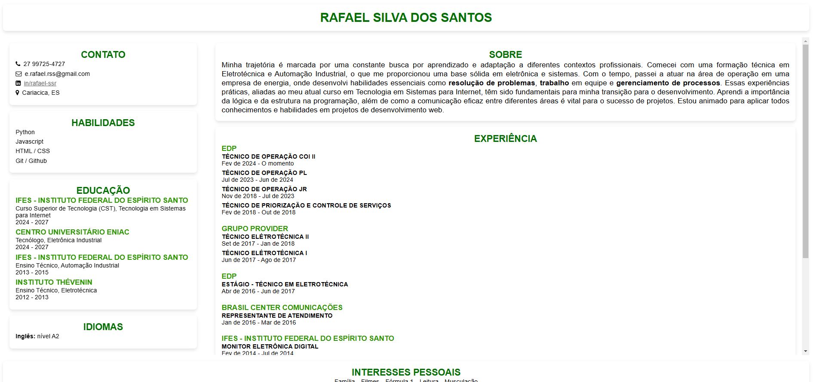
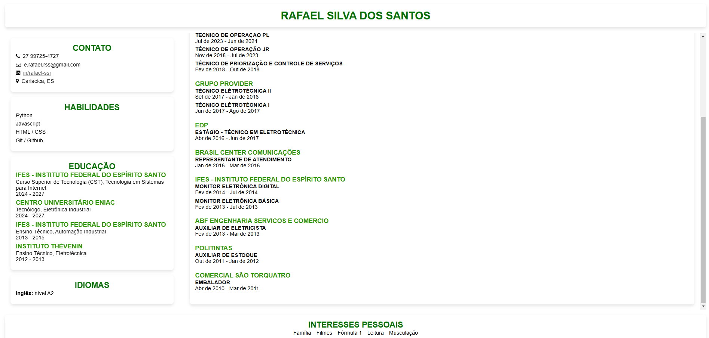
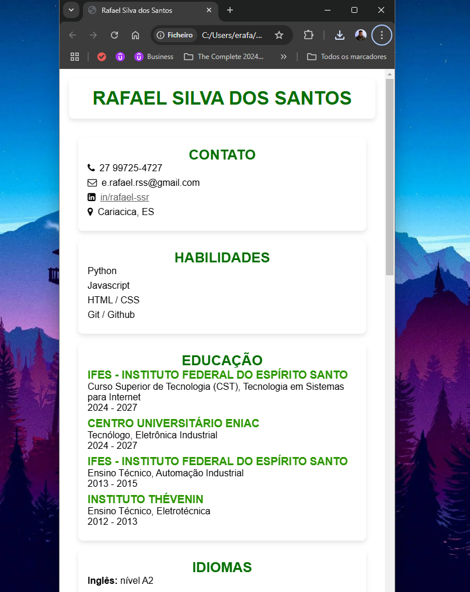
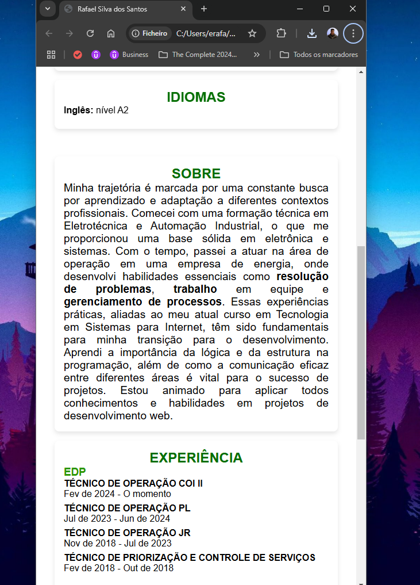
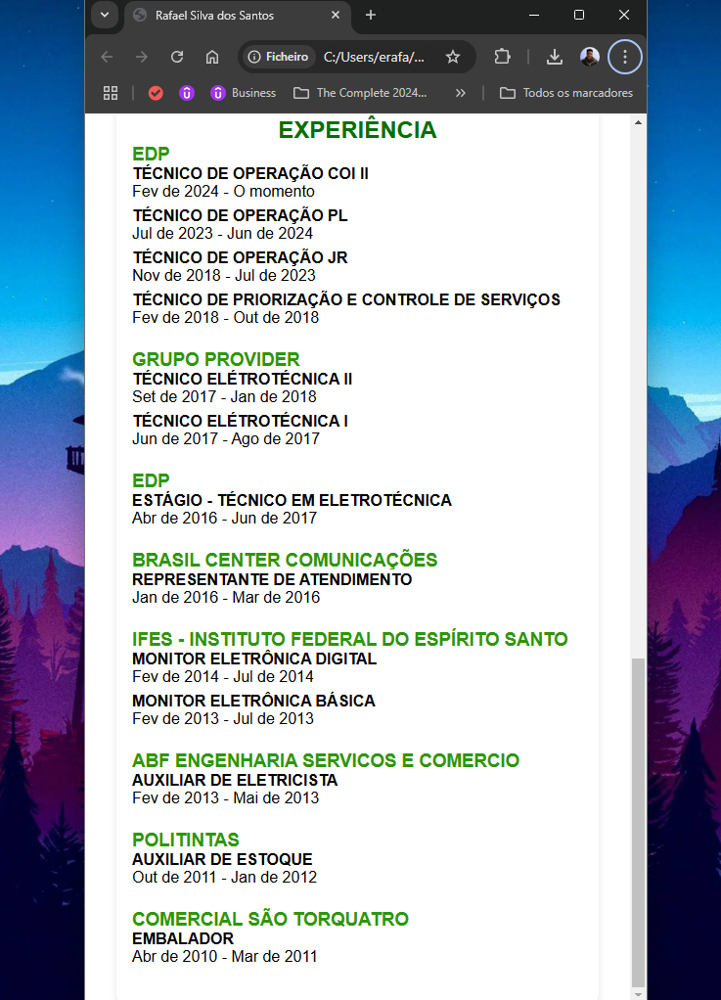

# Currículo Responsivo - Flexbox e Grid Layout

Este projeto consiste em um currículo pessoal criado utilizando HTML e CSS, com foco em um layout responsivo. O design foi feito com as técnicas de **Flexbox** e **Grid Layout**, garantindo uma boa visualização em diferentes dispositivos, como desktop, tablet e celular.

## Funcionalidades

- Layout responsivo com **Grid Layout** para se ajustar a diferentes tamanhos de tela.
- Utilização de **Flexbox** para organizar o conteúdo de forma flexível e eficiente.
- Estrutura simples e intuitiva, ideal para apresentar informações pessoais e profissionais.

## Tecnologias Utilizadas

- **HTML5**: Estrutura do conteúdo.
- **CSS3**: Estilização do layout e responsividade.
  - **Grid Layout**: Para criar o layout principal com duas colunas em telas grandes.
  - **Flexbox**: Para a organização de conteúdo em listas e seções.
  - **Media Queries**: Para garantir a responsividade e adaptação do layout em dispositivos móveis.

  

  

  

  

  

